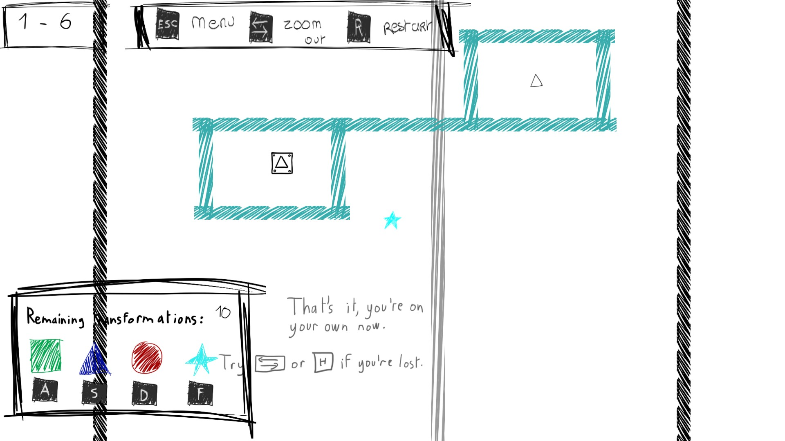

Unshaped-Mind
======

Unshaped-Mind is a puzzle game made during the spring 2016 semester at Keimyung University.

It was made with Unity 5.3.4

Authors
--------
[Marie Lefebvre] (https://github.com/marielefebvre) - Developer, Game & Level Designer

Camille Koziar - Developer, Game & Level Designer

Severine Febvet - Developer, Game & Level Designer, Artist

Elpidio - Developer, Game & Level Designer
